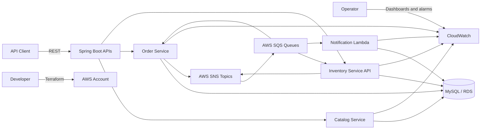
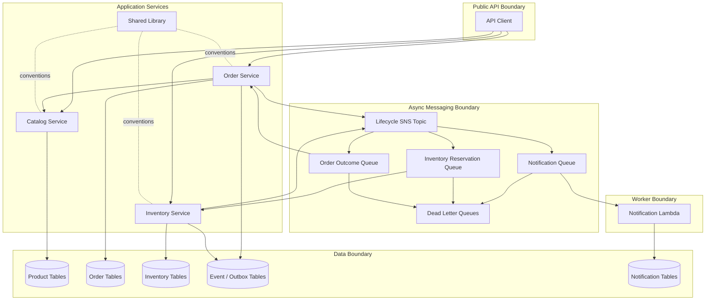
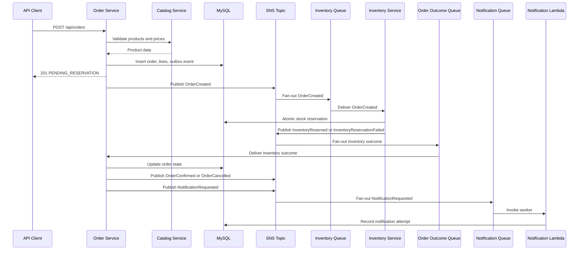
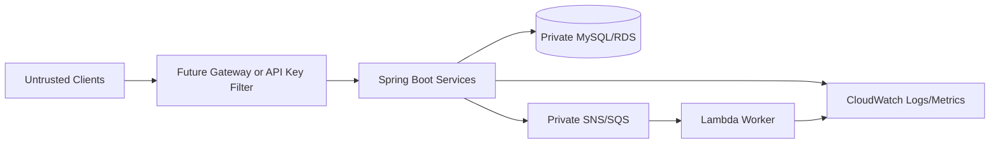

# InventoryHub Architecture Diagrams

## System Context

```mermaid
flowchart LR
  Client[API Client] -->|REST| API[Spring Boot APIs]
  Dev[Developer] -->|Terraform| AWS[AWS Account]
  Operator[Operator] -->|Dashboards and alarms| CloudWatch[CloudWatch]

  API --> Catalog[Catalog Service]
  API --> Orders[Order Service]
  API --> Inventory[Inventory Service API]

  Orders --> MySQL[(MySQL / RDS)]
  Catalog --> MySQL
  Inventory --> MySQL

  Orders --> SNS[AWS SNS Topics]
  Inventory --> SNS
  SNS --> SQS[AWS SQS Queues]
  SQS --> Inventory
  SQS --> Orders
  SQS --> Lambda[Notification Lambda]
  Lambda --> MySQL
  Catalog --> CloudWatch
  Orders --> CloudWatch
  Inventory --> CloudWatch
  Lambda --> CloudWatch
```

## Component View

```mermaid
flowchart TB
  subgraph PublicBoundary[Public API Boundary]
    Client[API Client]
  end

  subgraph ServiceBoundary[Application Services]
    Catalog[Catalog Service]
    Orders[Order Service]
    Inventory[Inventory Service]
    Shared[Shared Library]
  end

  subgraph AsyncBoundary[Async Messaging Boundary]
    Events[Lifecycle SNS Topic]
    InventoryQueue[Inventory Reservation Queue]
    OrderQueue[Order Outcome Queue]
    NotificationQueue[Notification Queue]
    DLQs[Dead Letter Queues]
  end

  subgraph DataBoundary[Data Boundary]
    ProductTables[(Product Tables)]
    OrderTables[(Order Tables)]
    InventoryTables[(Inventory Tables)]
    EventTables[(Event / Outbox Tables)]
    NotificationTables[(Notification Tables)]
  end

  subgraph WorkerBoundary[Worker Boundary]
    Notify[Notification Lambda]
  end

  Client --> Catalog
  Client --> Orders
  Client --> Inventory
  Orders --> Catalog
  Catalog --> ProductTables
  Orders --> OrderTables
  Orders --> EventTables
  Inventory --> InventoryTables
  Inventory --> EventTables
  Orders --> Events
  Inventory --> Events
  Events --> InventoryQueue
  Events --> OrderQueue
  Events --> NotificationQueue
  InventoryQueue --> Inventory
  OrderQueue --> Orders
  NotificationQueue --> Notify
  NotificationQueue --> DLQs
  InventoryQueue --> DLQs
  OrderQueue --> DLQs
  Notify --> NotificationTables
  Shared -. conventions .- Catalog
  Shared -. conventions .- Orders
  Shared -. conventions .- Inventory
```

## Order Lifecycle Sequence

```mermaid
sequenceDiagram
  participant C as API Client
  participant O as Order Service
  participant P as Catalog Service
  participant DB as MySQL
  participant SNS as SNS Topic
  participant IQ as Inventory Queue
  participant I as Inventory Service
  participant OQ as Order Outcome Queue
  participant NQ as Notification Queue
  participant L as Notification Lambda

  C->>O: POST /api/orders
  O->>P: Validate products and prices
  P-->>O: Product data
  O->>DB: Insert order, lines, outbox event
  O-->>C: 201 PENDING_RESERVATION
  O->>SNS: Publish OrderCreated
  SNS->>IQ: Fan-out OrderCreated
  IQ->>I: Deliver OrderCreated
  I->>DB: Atomic stock reservation
  I->>SNS: Publish InventoryReserved or InventoryReservationFailed
  SNS->>OQ: Fan-out inventory outcome
  OQ->>O: Deliver inventory outcome
  O->>DB: Update order state
  O->>SNS: Publish OrderConfirmed or OrderCancelled
  O->>SNS: Publish NotificationRequested
  SNS->>NQ: Fan-out NotificationRequested
  NQ->>L: Invoke worker
  L->>DB: Record notification attempt
```

## Trust Boundaries

```mermaid
flowchart LR
  Internet[Untrusted Clients] --> Gateway[Future Gateway or API Key Filter]
  Gateway --> Services[Spring Boot Services]
  Services --> PrivateDB[(Private MySQL/RDS)]
  Services --> Messaging[Private SNS/SQS]
  Messaging --> Lambda[Lambda Worker]
  Services --> Logs[CloudWatch Logs/Metrics]
  Lambda --> Logs
```
